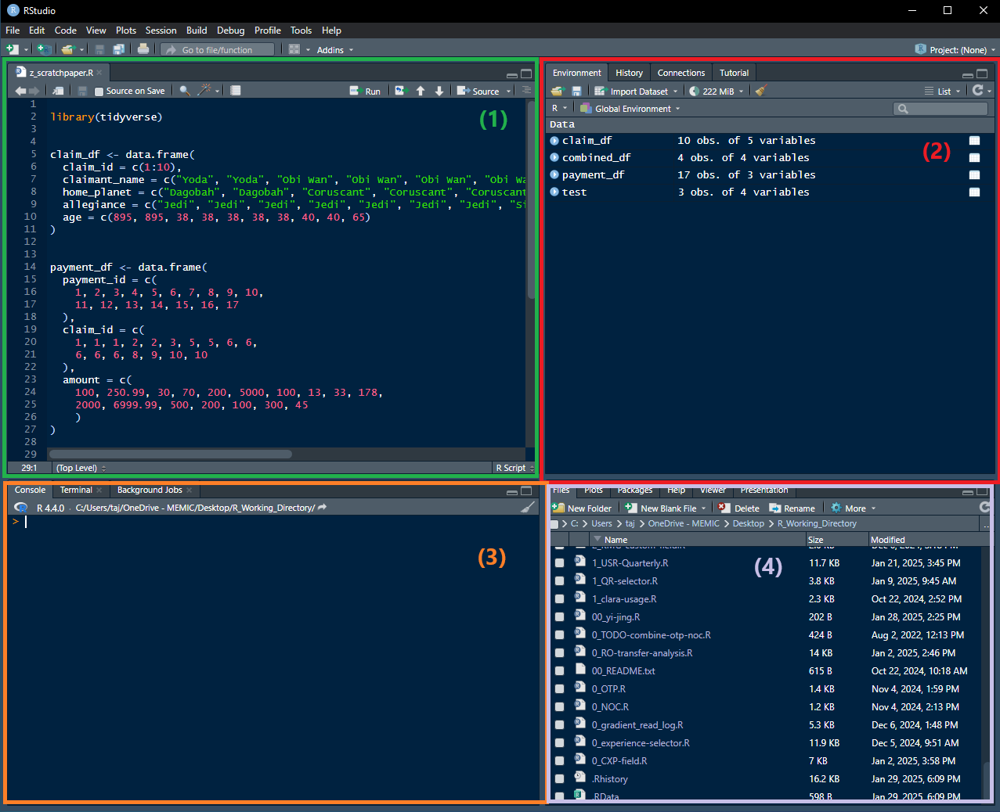

# RStudio Desktop IDE

--- 

After installing RStudio desktop, the IDE has a few components on the screen. These include: 
1) **Text Editor *(green):***  this pane lets you open and edit R scripts, markdown files, etc.
1) **Environment Window *(red)*:** this window lets you view variables and data objects in your environment. Complex objects like data frames, lists, etc. can be clicked and inspected in RStudio.
1) **Console / Terminal *(orange)*:** this has a console which lets you run R commands, interrupt processes, etc.
1) **File Inspector *(purple)*:** this window lets you explore your working directory, view generated plots, etc. 

