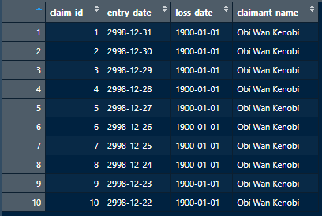

# Data Frames in R

--- 

While variables, vectors, and lists are useful in our programs, most of the data we use for reporting and analysis is stored in some kind of structured table. The data structure in base R for storing a table is called a ***data.frame***. Like tables in SQL databases data frames are composed of rows and columns, where columns may have different data types, but all values within one column should contain the same data type. In well structured data frames, one row of the table represents a unique observation of the various attributes stored in columns. 

More info. about the data.frame object can be found [here](https://www.rdocumentation.org/packages/base/versions/3.6.2/topics/data.frame). **Note:** *I will try to be clear, but may exchange the terms data frame and table in future sections. If I talk about tables in the context of an R project, I'm most likely referring to something stored as a data.frame object.* 

--- 

### Creating a Data Frame
\
Creating a new data frame is similar to creating a list. We assign a name to store our object (**df** *is a commonly used abbreviation in variable names*). Then, in parenthesis we can specify comma separated column names and column values. For an example, we will create a small mock-up of a claims table:

```r
claim_df <- data.frame(
  claim_id = c(1:10),
  entry_date = as.Date("2999-01-01") - 1:10, 
  loss_date = as.Date("1900-01-01"),
  claimant_name = "Obi Wan Kenobi"
)
```

After creating the `claim_df` object, we can inspect it in our IDE to see:



In the assignment above, we need to be careful about the number of values added into the data frame. If a column has different numbers of values, you can get an error. Additionally, we can see in the `loss_date` and `claimant_name` columns that if only one value is provided, R will use this as a default value applied to all rows in that column. 

Without too much trouble, we already have a table in R with different data types! This is the foundation for a lot of the work we'll be doing with R. Before moving on, we'll look at a few important attributes of data.frames. 

---

### Important Attributes of Data Frames
\
While working with data frames, it can help to learn some basic information about the dimensions and data types within the table. For the dimensions, we can use the `dim()`, `nrow()`, and `ncol()` functions in R:

```r
dim(claim_df)  # returns c(10, 4), showing the # of rows, and cols, respectively
nrow(claim_df) # returns 10, the number of rows in our df
ncol(claim_df) # returns 4, the number of cols in our df
```

If we want more info. about the rows or columns, we can also look at the `row.names()` and `colnames()` of our data frame (***Note:** the colnames tend to be more useful as we sometimes want to access or change a column name, we don't often need row names as they are by default just an integer to hold the row number*). 

```r
row.names(claim_df) # returns c("1", "2", ... "10")
colnames(claim_df)  # returns c("claim_id", "entry_date", "loss_date", "claimant_name")
```

Finally, if we want a summary of the whole table and an idea of the data types, we can use the `str()` function to see the structure of the data frame:

```r
str(claim_df) 
# returns 'data.frame':	10 obs. of  4 variables:
# $ claim_id     : int  1 2 3 4 5 6 7 8 9 10
# $ entry_date   : Date, format: "2998-12-31" "2998-12-30" ...
# $ loss_date    : Date, format: "1900-01-01" "1900-01-01" ...
# $ claimant_name: chr  "Obi Wan Kenobi" "Obi Wan Kenobi" "Obi Wan Kenobi" ...
```

---

### Practical Note Re: Working with Data Frames
\
We rarely will have to create new data frames from scratch as shown in the assignment step about to create the `claim_df`, however it is good to know this can be done if you need to put together a new table with data from different sources. 

Often, we'll load data into a data frame from a few different sources. Future sections will show how to load data from different sources like excel files, text/csvs, and SQL servers into data frames. 