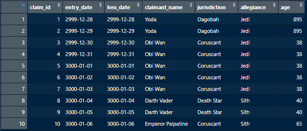

# Subsetting Data Frames

--- 

With our data in tabular format, there are many common operations we need to do like sort, filter, select values/subsets from a larger table, or join to other tables. This is easy in R knowing some notation, and we'll first review how to subset data frames. Before starting this discussion, we'll update our `claim_df` from the prior section to include a few more columns: 

```r
claim_df <- data.frame(
  claim_id = c(1:10),
  entry_date = as.Date("2999-12-27") + 1:10, 
  loss_date = as.Date("2999-12-27") + 1:10,
  claimant_name = c("Yoda", "Yoda", "Obi Wan", "Obi Wan", "Obi Wan", "Obi Wan", "Obi Wan", "Darth Vader", "Darth Vader", "Emperor Palpatine"), 
  jurisdiction = c("Dagobah", "Dagobah", "Coruscant", "Coruscant", "Coruscant", "Coruscant", "Coruscant", "Death Star", "Death Star", "Coruscant"),
  allegiance = c("Jedi", "Jedi", "Jedi", "Jedi", "Jedi", "Jedi", "Jedi", "Sith", "Sith", "Sith"), 
  age = c(895, 895, 38, 38, 38, 38, 38, 40, 40, 65)
)
```

Now, inspecting our table we see:



---

### The `$` Operator
\
When we look at the structure of our data frame using `str()` function, we can see that the column names have a `$` symbol before them: 

```r
#'data.frame':	10 obs. of  6 variables:
# $ claim_id     : int  1 2 3 4 5 6 7 8 9 10
# $ entry_date   : Date, format: "2999-12-28" "2999-12-29" ...
# $ loss_date    : Date, format: "2999-12-28" "2999-12-29" ...
# $ claimant_name: chr  "Yoda" "Yoda" "Obi Wan" "Obi Wan" ...
# $ jurisdiction : chr  "Dagobah" "Dagobah" "Coruscant" "Coruscant" ...
# $ allegiance   : chr  "Jedi" "Jedi" "Jedi" "Jedi" ...
# $ age          : int  895 895 38 38 38 38 38 40 40 65
```

The `$` is a special operator in R, which can be used to access named elements in a list or data frame. To access a column in a data frame as a vector, we can use the format: 

```r
# to access a column from our table
table_name$column_name

# if column name has spaces, surround in back-ticks to avoid an error
table_name$`column name w spaces` 
```

For example, here we can access the `allegiance` column in our `claim_df`:
```r
claim_df$allegiance

# returns c("Jedi", "Jedi", "Jedi", "Jedi", "Jedi", "Jedi", "Jedi", "Sith", "Sith", "Sith")
```

This can be handy, because it also lets us use aggregate functions across a column. Say for example we wanted to know the average age of the Jedi claimants in our table: 

```r
mean(claim_df$age)   # returns 212.5
median(claim_df$age) # returns 39
```

Hmm, a mean age of 212.5, Yoda's 895 years must be skewing the average on this one... Seeing the median age of 39 confirms this suspicion, not all Jedi and Sith are as lucky as Yoda. In any case, it is cool that we can calculate measures like this across columns with ease. Some other built in math functions that R has that are commonly used on columns include `sum()`, `min()`, `max()`, `quantile()`, etc. While it is great to access entire columns at a time, what if we only want to look at a specific value? 

---

### Square Bracket Subsetting of Data Frames
\
To access specific elements in a data frame, we can use square bracket notation, somewhat like when we were accessing elements in a vector. Recall that writing `my_vector[i]` would return the element at index `i` in a vector. For data frames, we give two values in the square brackets, separated by commas, to show indexes for which row and column we want to access:

```r
df[i, j] # returns the element in the i-th row, and j-th column of the df
```

While using this notation, we need to know that indexing in R for rows and columns starts at 1, instead of 0 like some other programming languages. For example:

```r
claim_df[1, 4] # returns "Yoda" the value at [row 1, column 4]
claim_df[3, 3] # returns "2999-12-30", the value at [row 3, column 3]
```

We can also use the assignment operator to change values in a data frame, for example:

```r
claim_df[1, 4] <- "Mace Windu" # reassigns the name at this spot in the table
```

There are a couple of tricks we can do with this square bracket subsetting. First, leaving either the row or column side of the square brackets will default to returning all rows or columns of the data frame, respectively. For example:

```r
claim_df[1, ]  # returns all columns for the first row 
claim_df[ , 3] # returns the values in column 3, across all rows
```

We can also subset using a vector within the square brackets, if we want to return multiple values. We can also change the order these appear in, if desired:

```r
claim_df[c(1, 2), ]     # returns all columns for the first 2 rows
claim_df[ , c(4, 3, 7)] # returns the columns 4, 3, then 7 for all rows
```

So, we have a lot of freedom in terms of what bits we pull out of a data frame.  These can be entire columns as vectors with the `$` operator, or single values / data frame subsets using `[ , ]` notation. There's a pattern we can use that combines both of these notations, that is useful in a few common data analysis tasks. 

---

### Combining `$` and `[ , ]` Notation to Subset Data Frames
\
Many of the base tables we pull data from have more data than we need, and we'll often need to dig into a smaller subset of the data when investigating different business questions. Some reasons for wanting to subset to smaller portions of a dataset I've seen include: 
1) Wanting to understand why claim penalties in a specific jurisdiction have been higher over a certain period of time.
1) Needing to pull out specific error codes from a larger set of errors. 
1) While writing an algorithm to randomly select claims for claim audits, claims from certain jurisdictions need to be routed to specific groups of managers. 

In all of these cases, there's a corresponding Boolean expression that will describe the criteria we need to filter out. Earlier while reviewing vectors, we showed how R can apply functions element wise to each thing in a vector. This also works for Boolean expressions! Take for example:

```r
claim_df$age 
# returns c(895, 895, 38, 38, 38, 38, 38, 40, 40, 65)
```

Say we wanted to find which claimants were > 200 years old, to investigate the outcomes of workplace injuries for extremely wise Jedi. We could write a Boolean expression with the whole column/vector: 

```r
claim_df$age > 200
# returns c(TRUE, TRUE, FALSE, FALSE, FALSE, FALSE, FALSE, FALSE, FALSE, FALSE)
```

The returned vector is now a vector of Booleans, showing which elements pass or fail the test `claim_df$age > 200`. We can combine the `$` notation to grab a column with a corresponding Boolean expression within square brackets, to return only rows / columns that met the condition of our test! For example, if we wanted to return all columns for Jedi claimant's with age > 200, we can write:

```r
# returns all columns, but only for rows where the value in the age col was > 200
claim_df[claim_df$age > 200, ] 
```

This reads as, find the rows where our expression `claim_df$age > 200` is `TRUE`, then return all columns for those rows (*because we left the second half of the square brackets after the comma blank*). We could modify the subsetting to only select specific columns for these rows, as well.  

Furthermore, we can write compound Boolean expressions to find smaller subsets of data. What if we want to review the claims of Sith who are > 200 years old? We can write this following compound expression within the square brackets:

```r
claim_df[(claim_df$age > 200) & (claim_df$allegiance == "Sith"), ]
```

This will only return rows where both the age was > 200, and the allegiance was == *'Sith'*. The returned data frame had 0 rows, so we know that there were no records in the data frame that met both conditions. The parenthesis were optional within the square brackets above, but can help clarify order of operations when writing longer compound expressions.  

--- 

### Subsetting within a Loop
\
Another useful way to subset data frames can be within a loop. Sometimes we will want to do some kind of separate calculation for all parts of a group, for example, tallying the number of claims within each jurisdiction in our claims table. We can use subsetting within a for loop to make this happen, saving each subset to a temporary table that is removed at the end of each loop iteration: 

```r
for(jur in unique(claim_df$jurisdiction)) {
    
    # save the subset of claim_df where all rows are in our current jurisdiction
    temp_df <- claim_df[claim_df$jurisdiction == jur, ]

    # ... do stuff w/ temp df ...

    # remove the jur & temp_df loop vars
    rm(jur, temp_df)
}
```

This loop creates a temporary variable `jur`, and then loops through each unique jurisdiction in our data frame. The subset of rows in that jurisdiction are stored in a new temporary table `temp_df`, which we can use for our calculations in the loop.

---

There are lots of creative ways to manipulate data in R, but this gives an idea of some of the basic tools for subsetting data frames to get different views or values from a table. Next up we'll look at the ***dplyr*** package which contains many handy functions for doing joins between tables, applying aggregate functions with greater ease, etc. 