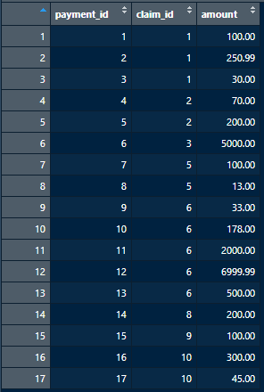
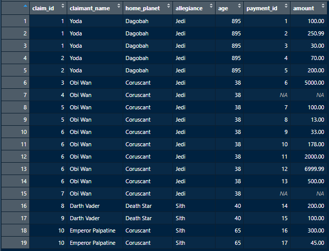
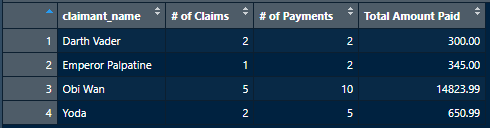

# Transforming Data with `dplyr`

---

dplyr is an R library with many useful data transformation capabilities. It makes both calculating aggregate measures across tables and selecting from / joining to other tables quite easy. 

To start, we will modify our data frame from the prior section, and write a new data frame so that we now have a `claim_df` and `payment_df`:

```r
claim_df <- data.frame(
  claim_id = c(1:10),
  claimant_name = c("Yoda", "Yoda", "Obi Wan", "Obi Wan", "Obi Wan", "Obi Wan", "Obi Wan", "Darth Vader", "Darth Vader", "Emperor Palpatine"),
  home_planet = c("Dagobah", "Dagobah", "Coruscant", "Coruscant", "Coruscant", "Coruscant", "Coruscant", "Death Star", "Death Star", "Coruscant"),
  allegiance = c("Jedi", "Jedi", "Jedi", "Jedi", "Jedi", "Jedi", "Jedi", "Sith", "Sith", "Sith"),
  age = c(895, 895, 38, 38, 38, 38, 38, 40, 40, 65)
)

payment_df <- data.frame(
  payment_id = c(
    1, 2, 3, 4, 5, 6, 7, 8, 9, 10,
    11, 12, 13, 14, 15, 16, 17
  ),
  claim_id = c(
    1, 1, 1, 2, 2, 3, 5, 5, 6, 6,
    6, 6, 6, 8, 9, 10, 10
  ),
  amount = c(
    100, 250.99, 30, 70, 200, 5000, 100, 13, 33, 178,
    2000, 6999.99, 500, 200, 100, 300, 45
    )
)
```
\
Inspecting these data frames, we now have:

**Claim:**


**Payment:**



This will give us a small example of some tables we may want to apply some aggregate functions over, and join together. Before getting into this with `dplyr`, we'll talk about some `dplyr` specific syntax. 


---

### The Pipe Operator (`%>%`)
\
One important operator for simplifying data manipulation with dplyr is the pipe operator, `%>%`. Recall that with the `$` operator, we could grab a column of a data frame and throw it into some function. For example:

```r
mean(claim_df$age) # returns 212.5
```

We can write this same code in a different way using the pipe operator: 
```r
library(dplyr)
claim_df$age %>% mean() # also returns 212.5
```

This can be pictured as a flow of data into some function, where the object or value we put on the left hand side of the pipe operator is chucked into whatever function is on the right hand side. 

This behavior enables us to chain together multiple functions with easy. For example, we can write the following:

```r
payment_df$amount %>% sum() %>% round(digits = 0) # returns 16120
```

When chained, the order is read from left to right, and a function's value must be returned before proceeding to the next step. In our example above, the `amount` column in `payment_df` was sent into the `sum()` function which returned a value of 16119.98, which was in turn sent into the `round()` function and rounded up to 16120.

--- 

### Summarizing Tables with `dplyr`
\
Now that we have a basic understanding of what the pipe operator is doing, we can write expressions to summarize data frames with `dplyr`. This can be quite useful for calculating summary statistics across different groups within a data set. 

The basic structure is that `dplyr` has a few functions such as `filter()`, `group_by()`, and `summarize()`. We can send our data frame into a cascading water slide of functions with a nicely summarized output on the other end:

```r
summarized_df <- claim_df %>% 
    filter(age >= 40) %>% 
    group_by(home_planet) %>% 
    summarize(
  `# of Jedi Claims` = sum(allegiance == "Jedi"),
  `# of Sith Claims` = sum(allegiance == "Sith"),
  `Average Age of Claimant` = mean(age)
)
```

This results in the following data frame:


First we pipe in our claim data to the `filter()` function, where rows with the age < 40 are removed. Then, we use the `group_by()` function to specify that we'd like further aggregating functions to be aggregated across the home planet. Finally, in `summarize()` we can specify new columns that are created with aggregating functions. ***Note:** for dplyr, column names are written without any quotation marks. If you have a column name with spaces in it, you can surround that name with back ticks `` to avoid an error.* 

This is just a small intro. to summarizing tables with dplyr, but more info. can be found on their [documentation page](https://dplyr.tidyverse.org/). They have helpful pdf *"cheat sheets"* that visually summarize the different operations. Some other helpful dplyr functions include `mutate()`, which lets you create new calculated columns, and `arrange()`, which lets you sort the output table. 

---

### Combining and Joining Tables
\
The `dplyr` library also has helpful functions for combining and joining tables. The `bind_rows()` can be used to combine two data frames row wise that have the same columns, but different rows, while the `bind_cols()` function can be used to combine two data frames column wise that have different columns, but for the same row/ids.

There are also functions that enable SQL like joins between two data frames. The main join functions are `left_join()`, `right_join()`, `inner_join()`, and `full_join()`. 

For our tables above, we may want to join the `payment_df` to `claim_df`, so that we can find out how much money has been paid out on claims for the difference claimants. This can be done by writing: 

```r
combined_df <- claim_df %>% left_join(
  y = payment_df, by = c("claim_id" = "claim_id")
)
```

The argument `y` specifies which table we'd like to join to the `claim_df`, and the `by` argument specifies what keys these tables join on. Inspecting the result, we see:



We used left join so that all claim ids would be preserved even if that specific claim didn't have payments on it, as we can see with the claim ids 4 and 7, that return `NA` once joined. Additionally we can see that the number of rows in our combined data frame have increased, as some claim ids are associated with more than one payment record in the payments data frame. 

We can even chain our summarizing functions on after joining tables, and in a few lines of code go from two separate tables to a joined table that has been summarized:

```r
combined_summarized_df <- claim_df %>% left_join(
  
  # join payment_df to claim_df on claim_id key
  y = payment_df, by = c("claim_id" = "claim_id")
  
) %>% group_by(claimant_name) %>% summarise(
  
  # calc num claims, num payments, & total amount paid
  `# of Claims` = length(unique(claim_id)),
  `# of Payments` = n(),
  `Total Amount Paid` = sum(amount, na.rm = TRUE)
  
)
```

**Combined and Summarized Data Frame:**



Some things to note in our summarized table above:
1) `n()` is a shorthand notation in dplyr that lets you do a count of all rows within a group.
1) For some functions like `sum()`, we can occasionally see weird results if we apply over a column with `NAs`. Because two of our claims don't have associated payments, we could get a wrong amount for *"Obi Wan"* if we didn't specify the `na.rm = TRUE` argument. This argument tells R to calculate the sum, while ignoring rows that are `NA`. 

