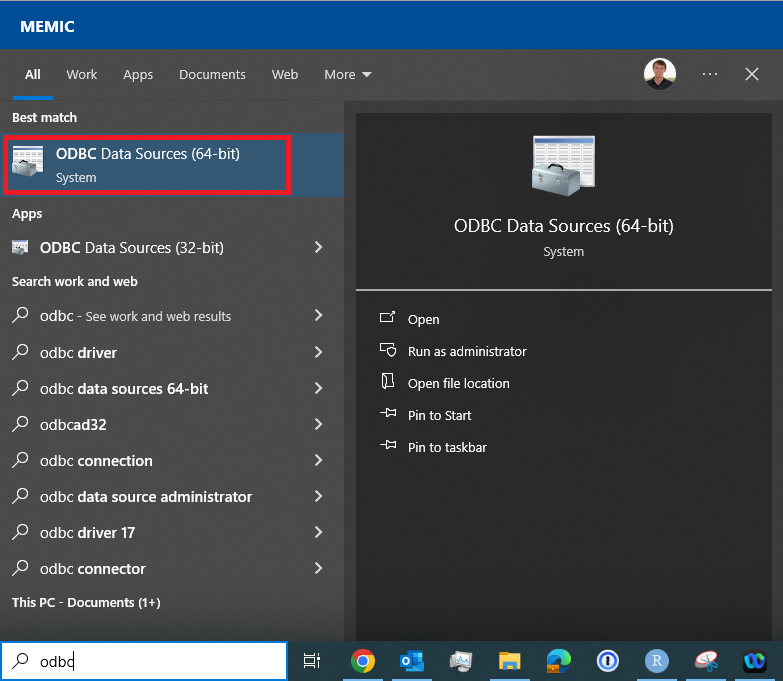
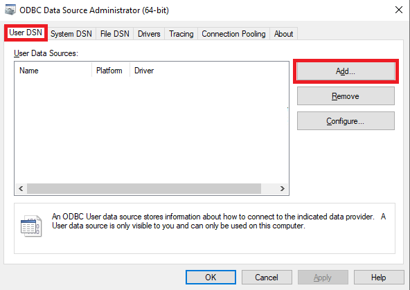
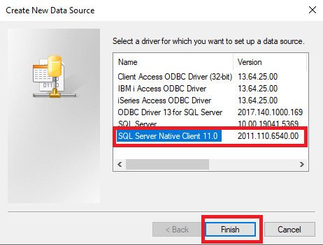
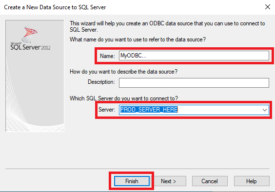
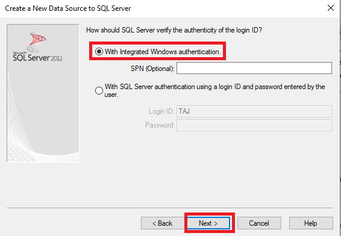
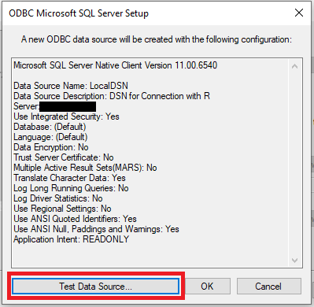
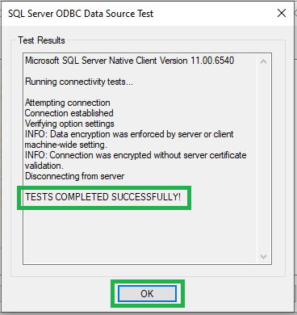

# Creating a Custom ODBC Connection 

--- 

If needed, we can add our own ODBC connection to our computers ODBC list for connecting to SQL servers. To do this we can first search for the `ODBC Data Sources` app on our computer:

Then, once in the app we can click `Add` under the `User DSN` page:

For connections like CXP production, we can choose `SQL Server Native Client 11.0` for the driver, adding whatever name we want for the DSN, then specifying the server to connect to:

**Part 1:**

**Part 2:**

We can use `Integrated Windows Authentication`, and leave the other options default. 

Finally, there's a connection test option to ensure that the ODBC is working correctly:

**Starting Test:**

**Test Complete:**

