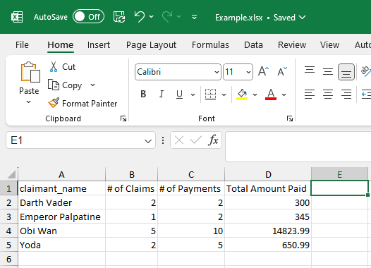
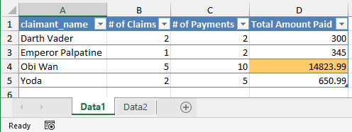
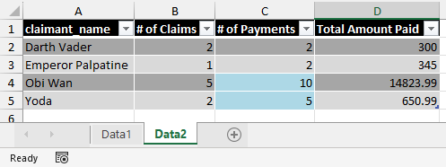

# Writing Data Frames to Excel

--- 

While reading in data is certainly useful, we often want to generate some output that others can use. This can be particular useful for automated reporting, where we want to have some file delivered out to different business users on a regular basis. This can be accomplished with the `openxlsx` library. We will look at two examples, one that generates a simple Excel file, and another that generates more customized formatting in an Excel file. 

---

### Simple Excel Files
\
For a simple output file where we are not too concerned with the formatting of the workbook, we can use the `write.xlsx()` function within `openxlsx`. Remember our example earlier where we used dplyr to generate some interesting data about the Jedi claims: 

```r
# load tidyverse for dplyr
library(tidyverse)

# --- setup the claim data frame

claim_df <- data.frame(
  claim_id = c(1:10),
  claimant_name = c("Yoda", "Yoda", "Obi Wan", "Obi Wan", "Obi Wan", "Obi Wan", "Obi Wan", "Darth Vader", "Darth Vader", "Emperor Palpatine"),
  home_planet = c("Dagobah", "Dagobah", "Coruscant", "Coruscant", "Coruscant", "Coruscant", "Coruscant", "Death Star", "Death Star", "Coruscant"),
  allegiance = c("Jedi", "Jedi", "Jedi", "Jedi", "Jedi", "Jedi", "Jedi", "Sith", "Sith", "Sith"),
  age = c(895, 895, 38, 38, 38, 38, 38, 40, 40, 65)
)

# --- setup the payments data frame

payment_df <- data.frame(
  payment_id = c(
    1, 2, 3, 4, 5, 6, 7, 8, 9, 10,
    11, 12, 13, 14, 15, 16, 17
  ),
  claim_id = c(
    1, 1, 1, 2, 2, 3, 5, 5, 6, 6,
    6, 6, 6, 8, 9, 10, 10
  ),
  amount = c(
    100, 250.99, 30, 70, 200, 5000, 100, 13, 33, 178,
    2000, 6999.99, 500, 200, 100, 300, 45
    )
)


# --- use dplyr to join the data frames and summarize

combined_summarized_df <- claim_df %>% left_join(
  
  # join payment_df to claim_df on claim_id key
  y = payment_df, by = c("claim_id" = "claim_id")
  
) %>% group_by(claimant_name) %>% summarise(
  
  # calc num claims, num payments, & total amount paid
  `# of Claims` = length(unique(claim_id)),
  `# of Payments` = n(),
  `Total Amount Paid` = sum(amount, na.rm = TRUE)
  
)

...
```

We can use `write.xlsx()` to save our combined summarized data frame to an Excel file: 

```r
... 

# load library for writing to Excel
library(openxlsx)

# write our data frame from before to a new Excel file
write.xlsx(
  x = combined_summarized_df,
  file = "./Excel_Outputs/Example.xlsx",
  asTable = FALSE
)
```

We now have a new Excel file with our generated data!



If desired, we can set `asTable` to `TRUE` to have the data stored in an Excel Table. 

---

### Generating Detailed Excel Files
\
If we want to get more specific with how our output files are formatted, `openxlsx` has a set of functions for creating Excel Workbook objects, adding Sheets, formatting those sheets, etc. The next example shows this, and assumes we have the same `combined_summarized_df` from before:

```r
...

# load library for writing to Excel
library(openxlsx)

# create a new workbook object to store data
wb <- createWorkbook()

# add two worksheets to the workbook
addWorksheet(wb, sheetName = "Data1")
addWorksheet(wb, sheetName = "Data2")

# write data to first sheet with one style
writeDataTable(
  wb, 
  sheet = "Data1", 
  x = combined_summarized_df,
  tableStyle = "TableStyleLight9"
) 

# write data to second sheet with a different style
writeDataTable(
  wb, 
  sheet = "Data2", 
  x = combined_summarized_df,
  tableStyle = "TableStyleMedium8"
) 

# find data points to highlight on table #1
y <- which(colnames(combined_summarized_df) == "Total Amount Paid")
x <- which(combined_summarized_df$`Total Amount Paid` > 10000)
addStyle(
  wb, 
  sheet = "Data1", 
  style = createStyle(fgFill = "#FFCC66"), 
  rows=x+1, 
  cols=y, 
  gridExpand=TRUE
) # we add +1 to rows to account for header line

# find data points to highlight on table #2
y <- which(colnames(combined_summarized_df) == "# of Payments")
x <- which(combined_summarized_df$`# of Payments` >= 5)
addStyle(
  wb, 
  sheet = "Data2", 
  style = createStyle(fgFill = "#ADD8E6"), 
  rows=x+1, 
  cols=y, 
  gridExpand=TRUE
) # we add +1 to rows to account for header line

# save workbook to an excel file
saveWorkbook(
  wb, 
  "./Excel_Outputs/Example2.xlsx", 
  overwrite=TRUE
)

```

This takes more lines of code, but gives us extra freedom in terms of what we can create. For example, our table on the `Data1` sheet is now in a formatted table, with cells having paid amounts > 10,000 highlighted in yellow:



Additionally, `Data2` now has a separate data table with a different format, where cells having >= 5 payments are highlighted in light blue:



As you can tell from the examples, once we start using libraries like this with more features, there are many function arguments to learn and specify. It is a good skill to get used to reading the documentation of these libraries, or looking at the examples of others to help you get your data in the format you'd prefer. The documentation for `openxlsx` is quite extensive, and can be found [here](https://www.rdocumentation.org/packages/openxlsx/versions/4.2.8).

Now that we've looked at a variety of ways to get data, manipulate it, and save new outputs, we'll look at data visualization capabilities in R using the `ggplot2` library.